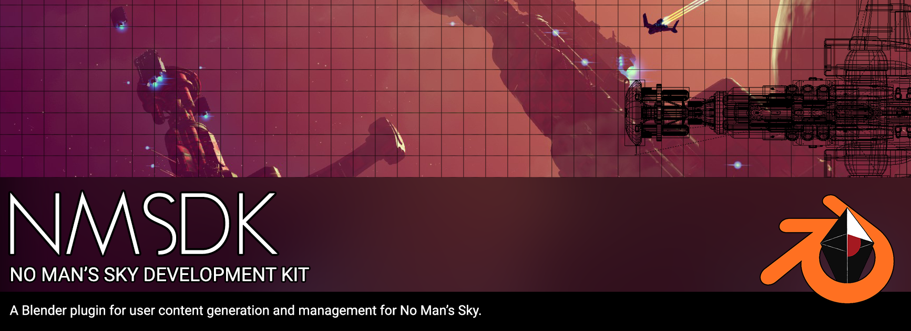

# NMS Custom Model Importer (NMSDK)

NMSDK is a blender plugin designed to allow models to be added to No Man's Sky, as well as to load models from the games' data.

For full documentation such as installation instructions, API details and details on various functions see the NMSDK website here: https://monkeyman192.github.io/NMSDK/

### Installing NMSDK

Installing NMSDK is very easy. Head to the [NMSDK Release page](https://github.com/monkeyman192/NMSDK/releases) on GitHub and download the most recently released version.

Open Blender and open the user settings (Ctrl + Alt + U) (or `File` > `User Preferences...`), and select `Install Add-on from File...` (it is at the bottom left of the window).
Select the `.zip` file you just downloaded and blender should install it without any errors.

To make exporting easier, NMSDK will automatically convert all produced `.mxml` files to `.mbin` files. For this to work, [MBINCompiler](https://github.com/monkeyman192/MBINCompiler) is required. See below for instructions on downloading and installing the latest version.

### Prerequisites

#### Blender

NMSDK requires a version of Blender greater than or equal to 3.2

#### MBINCompiler

For NMSDK to work, it requires [MBINCompiler](https://github.com/monkeyman192/MBINCompiler)
to generate the *.mbin* files that are read by the game.
The easiest way to have *MBINCompiler* set up is to download the most recent
release and register *MBINCompiler* to the path so that it can be picked up
anywhere by Blender.
If you already have a version of *MBINCompiler* on your computer, ensure it is the latest version. This can be found on the [MBINCompiler releases](https://github.com/monkeyman192/MBINCompiler/releases) page.

For NMSDK to be able to use *MBINCompiler*, the program needs to be registered to the path so that it can be called from anywhere on your computer.
Open the folder containing the `MBINCompiler.exe` you just downloaded, open this folder as admin in command line, then enter `MBINCompiler.exe register`.
This will add the folder the `.exe` is in to the system path, allowing NMSDK to be able to access the program from anywhere.

---

### Usage

For a comprehensive guide on using NMSDK, please visit the [documentation](https://monkeyman192.github.io/NMSDK/) for more details.

### Running Tests

If you are looking to develop NMSDK, there are a number of tests that can be run so ensure the added functionality doesn't cause any regressions.
If new features are added, it is highly encouraged that new tests are written to ensure good code coverage (not currently tracked, and not even sure if it is possible to...)

To run the tests, you must have NMSDK cloned from git, and not simply installed. If you're using Github Desktop, you will also need Git for Windows installed to have Git Bash available. In a console, then run
```
./run_tests.sh`.
```
This will run all the tests.

This script can have specific test files passed to it as an argument, and these are passed to pytest, which is the underlying test runner.

For example, to run a single individual test you could enter
```
./run_tests.sh tests/import_tests/import_test.py::test_import_crystal
```

This script uses the Blender that is assigned to open .blend files - do Blender.exe -R to associate Blender with .blend files. To learn how to specify an alternative Blender executable or for more info, use `./run_tests.sh -h` to see the help and options.

### Credits

 - Primarily coded and maintained by monkeyman192.
 - Original functionality for extracting data from blender provided by Gregkwaste.
 - Thanks to GmrLeon for their assistance in converting structs to python for the entity construction.
 - And big thanks to MsrSgtShooterPerson for the fantastic banner!
 - Thanks to everyone in the [NMS Modding discord](https://discord.gg/22ZAU9H) who has helped bug fix.
